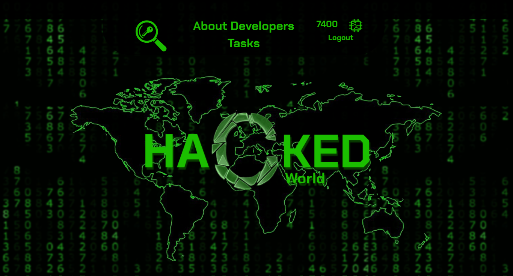

# CTF Platform

## Platform for conducting CTF (Capture The Flag)

### The platform was developed by two students of SRSPU(NPI):
####     [Developer : Makhmudov Shamil]( https://www.linkedin.com/in/shamil-makhmudov-86a9831a9/ )
####     [Designer : Alexander Kozyrkov](https://vk.com/kozyrkov_alll) 


## Main Page 



## Start Project

Installing dependencies to run the project
```bash
    npm run prepare
```

Run manager , server and client
```bash
    npm run start:all
```

Run server 
```bash
    npm run start:server
```

Run server & manager
```bash
    npm run start:manager
```

Run server & client
```bash
    npm run start:client
```


